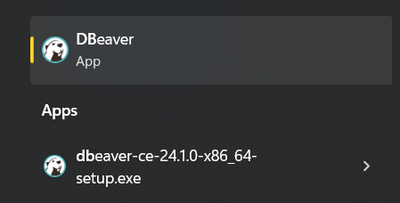
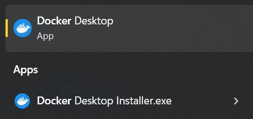
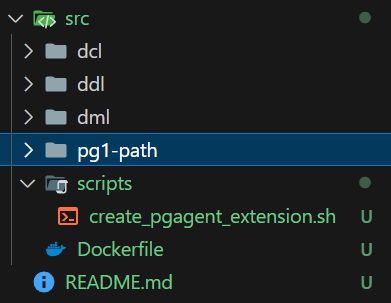
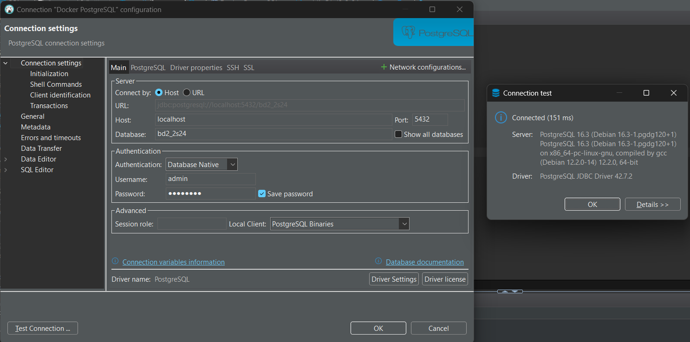
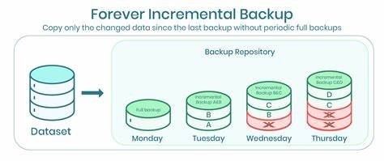
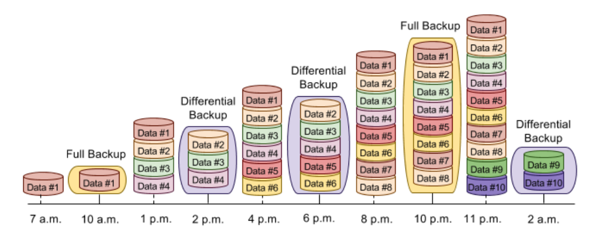

# -SBD2-S1-2025-Pareja4
Levantar Docker

## Instalación de herramientas

### Cliente SQL



### Docker Desktop (Windows)

**Recomendación:** realizar instalación con wsl2.



## Configuración Docker 

### Creación de carpetas y configuraciones iniciales



* **Carpeta pg1-path (obligatorio):** contiene la estructura de directorios y archivos de datos de PostgreSQL, crucial para el funcionamiento y almacenamiento de la base de datos.

* **Carpeta Scripts (obligatorio):** Contiene los scripts que usa el Dockerfile.

### Creación de Dockerfile

```dockerfile
# Usa la imagen oficial de PostgreSQL
FROM postgres:latest

# Variables de entorno para la configuración de PostgreSQL
ENV POSTGRES_USER=admin
ENV POSTGRES_PASSWORD=root1234
ENV POSTGRES_DB=bd2_2s24

## Instalar pgAgent para evitar error de extensión no encontrada (al menos en dbeaver aparece el error frecuentemente y puede ser molesto)

RUN apt-get update && apt-get install -y pgagent

# Script para crear la extensión pgAgent después de iniciar PostgreSQL
COPY create_pgagent_extension.sh /docker-entrypoint-initdb.d/create_pgagent_extension.sh
RUN chmod +x /docker-entrypoint-initdb.d/create_pgagent_extension.sh

## Fin de instalación de pgAgent

# Crear un directorio para scripts de inicialización (opcional)
# COPY init.sql /docker-entrypoint-initdb.d/

# Exponer el puerto PostgreSQL
EXPOSE 5432

# Comando para ejecutar PostgreSQL
CMD ["postgres"]
```

### Creación de imagen 

**Nota:** (ejecutar comando al mismo nivel de donde se encuentre el Dockerfile)

```sh
docker build -t custom-postgres .
```

### Creación de contenedor

**Nota:** los saltos de línea son con **`** porque se ejecuta comando en powershell. Tomar en cuenta cambio en cmd, unix/linux/bash, etc...

#### Plantilla: 
```sh
docker run -d `
  --name postgres `
  -v /ruta/local/a/tu/data:/var/lib/postgresql/data `
  -p 5432:5432 `
  custom-postgres
```

#### Ejemplo:

```shell
docker run -d `
  --name postgres `
  -v C:\proyectos\GUIDE_TO_DATABASES_BD2_2S24\Clase#1-Introducción_SQL\src\pg1-path:/var/lib/postgresql/data `
  -p 5432:5432 `
  custom-postgres
```

## Configuración y prueba de conexión



# Source 
https://github.com/diegomazariegos2002/GUIDE_TO_DATABASES_BD2_2S24


# Clase #3 - Introducción a los Backups y Respaldos

En esta clase se abordarán los siguientes temas: 

- Introducción a los diferentes tipos de respaldo: completo, incremental y diferencial
- Estrategias de respaldo según el tamaño y uso de la base de datos
- Herramientas de respaldo: ventajas y desventajas de diferentes soluciones
- Automatización de respaldos: creación de scripts para realizar respaldos regulares
- Planificación de respaldos: cómo definir la frecuencia adecuada
- Recuperación a partir de diferentes tipos de respaldos
- Ejercicio práctico: implementación de un plan de respaldo en un entorno de prueba utilizando pgdump (postgresql), generando un backup completo con restauración en caliente.

## Introducción a los diferentes tipos de respaldo

### Respaldo Completo


- Copia de todos los datos de la base de datos
- Se realiza de forma periódica
- Permite recuperar la base de datos en su totalidad
- Ventajas: fácil de implementar, rápida recuperación
- Desventajas: consume más espacio de almacenamiento, requiere más tiempo de ejecución

### Respaldo Incremental



- Copia de los datos que han cambiado desde el último respaldo
- Se realiza de forma periódica
- Permite recuperar la base de datos a partir de un punto específico
- Ventajas: consume menos espacio de almacenamiento, menor tiempo de ejecución
- Desventajas: recuperación más compleja, dependencia de respaldos anteriores

### Respaldo Diferencial



- Copia de los datos que han cambiado desde el último respaldo completo
- Se realiza de forma periódica
- Permite recuperar la base de datos a partir del último respaldo completo
- Ventajas: consume menos espacio de almacenamiento, recuperación más rápida
- Desventajas: recuperación más compleja, dependencia de respaldos anteriores

## Estrategias de respaldo según el tamaño y uso de la base de datos

### Base de Datos Pequeña

- Respaldo completo diario
- Respaldo incremental o diferencial cada hora

### Base de Datos Mediana

- Respaldo completo diario
- Respaldo incremental o diferencial cada 6 horas

### Base de Datos Grande

- Respaldo completo diario
- Respaldo incremental o diferencial cada 12 horas

## Herramientas de respaldo: ventajas y desventajas de diferentes soluciones

### pg_dump

- Herramienta de respaldo nativa de PostgreSQL
- Permite realizar respaldos completos o de esquemas específicos
- Ventajas: fácil de usar, compatible con diferentes versiones de PostgreSQL
- Desventajas: no es escalable para bases de datos grandes, no soporta respaldos incrementales

### pgBackRest

- Herramienta de respaldo externa para PostgreSQL
- Permite realizar respaldos completos, incrementales y diferenciales
- Ventajas: escalable para bases de datos grandes, soporta respaldos incrementales
- Desventajas: requiere configuración adicional, no es compatible con todas las versiones de PostgreSQL

## Full Backup PostgreSQL (Método 1: pgdump)

### Creación Full Backup

Plantilla Comando (**Recordar que estos comandos son ejecutados en powershell** por lo que la función de las fechas puede varias si se ejecuta en cmd, unix/linux/bash, etc...):

```sh
docker exec `
-t postgres `
pg_dumpall `
-c `
-U admin > C:\Users\PC\Documents\Erick\2025 primer semestre\Sistemas de bases 2\Laboratorio\-SBD2-S1-2025-Pareja4\backup\backup_full_$(Get-Date -Format yyyy-MM-dd).sql


docker exec -e PGPASSWORD=root1234 -t postgres pg_dumpall -c -U admin > "C:\Users\PC\Documents\Erick\2025 primer semestre\Sistemas de bases 2\Laboratorio\-SBD2-S1-2025-Pareja4\backup\backup_full_$(Get-Date -Format yyyy-MM-dd).sql"
```

**¿Qué hace el comando  anterior en si?**

- docker exec -> ejecuta un comando dentro de un contenedor de docker.

- -t postgres -> nombre del contenedor de docker.

- pg_dumpall -> comando de postgresql para hacer respaldos completos.

  - -c -> limpia la base de datos antes de restaurar.

  - -U tu_usuario > ruta -> se especifica el usuario de la base de datos y la ruta donde se guardará el respaldo.

ejemplo:
```sh
docker exec `
-t postgres `
pg_dumpall `
-c `
-U admin > C:\proyectos\GUIDE_TO_DATABASES_BD2_2S24\Clase3-Introduccion_Backups\src\dml\backups\backup_full_$(Get-Date -Format yyyy-MM-dd).sql
```

*Nota: también existe el comando **pgdump** pero esto no hace respaldo de roels y tablaspace, pero puede ser utilizado para respaldar un único esquema o base de datos en el servidor postgreSQL*

### Automatización de respaldos: creación de scripts para realizar respaldos regulares

#### Script de Respaldo Completo con pg_dump (ejemplo básico en bash)

```sh
#!/bin/bash

# Variables
FECHA=$(date +"%Y-%m-%d")
USUARIO="usuario"
CONTRASENA="contrasena"
BASE_DATOS="basedatos"
RUTA="/ruta/respaldos"

# Crear respaldo completo
pg_dump -U $USUARIO -d $BASE_DATOS > $RUTA/backup_full_$FECHA.sql
```

### Restauración Full Backup

**Nota:** para que la restauración del backup funcione como tal, debe hacerse un drop y luego un create de la base de datos de la cual se hizo el backup.

Plantilla Comando (**Recordar que estos comandos son ejecutados en powershell** por lo que la función de las fechas puede varias si se ejecuta en cmd, unix/linux/bash, etc...):

```sh
Get-Content -Raw -Path "/ruta/local/backups/backup_full_yyyy-MM-dd.sql" | docker exec -i postgres psql -U username -d postgres
```

**¿Qué hace el comando  anterior en si?**

- Get-Content -> obtiene el contenido de un archivo.

  - -Raw -> obtiene el contenido del archivo como una sola cadena.

  - -Path -> ruta del archivo a leer.

- | -> redirige la salida del comando anterior al siguiente comando.

- docker exec -> ejecuta un comando dentro de un contenedor de docker.

  - -i -> permite la entrada interactiva.

  - postgres -> nombre del contenedor de docker.

  - psql -> comando de postgresql para ejecutar sentencias SQL.

    - -U username -> usuario de la base de datos.

    - -d postgres -> nombre de la base de datos.


Ejemplo:

```sh
Get-Content -Raw -Path "C:\Users\PC\Documents\Erick\2025 primer semestre\Sistemas de bases 2\Laboratorio\-SBD2-S1-2025-Pareja4\backup\backup_full_2025-04-21.sql" | docker exec -i postgres psql -U admin -d postgres
```

#### Comandos extras para hacer pruebas

```sh
docker exec -i postgres psql -U admin -d postgres -c "DROP DATABASE IF EXISTS bd2_2s24;"
```

```sh
docker exec -i postgres psql -U admin -d postgres -c "CREATE DATABASE bd2_2s24;"
```
# Clase #4 - Recuperación de respaldos con pgbackrest 

En esta clase se abordarán los siguientes temas: 

- Introducción a las estrategias de recuperación de datos
- Recuperación de bases de datos utilizando respaldos completos
- Recuperación con respaldos incrementales y diferenciales
- Técnicas avanzadas de recuperación de datos
- Simulación de pérdida de datos: escenarios de recuperación
- Herramientas y utilidades para la recuperación de bases de datos
- Caso práctico: recuperación de una base de datos tras un fallo simulado, generado diversos backups con pgbackrest y restaurando en frío la base  de datos.

## Pgbackrest y su relación con postgresql

Pgbackrest es una herramienta de respaldo y restauración de bases de datos PostgreSQL que se enfoca en la simplicidad y velocidad. Proporciona una solución de respaldo de alto rendimiento para entornos de producción críticos donde el tiempo de respaldo y restauración es importante.

De forma nativa postgresql no cuenta con herramientas de respaldo y restauración de tipo diferencial o incremental, por lo que pgbackrest se convierte en una herramienta muy útil para realizar respaldos de este tipo.

Tomar en cuenta los siguientes conceptos a la hora de trabajar con pgbackrest:

- **Stanza**: Es un conjunto de configuraciones que se utilizan para respaldar una base de datos. Cada stanza tiene su propio conjunto de configuraciones y directorios de respaldo.

- **WALL (Write-Ahead Logging)**: Es un mecanismo de registro de transacciones que garantiza la integridad de los datos en caso de fallo del sistema. Los archivos de registro de transacciones (WAL) contienen todos los cambios realizados en la base de datos.

- **Archive**: Es el proceso de almacenar los archivos de registro de transacciones (WAL) en un repositorio de respaldo.

- **Replikation**: Es el proceso de copiar los archivos de registro de transacciones (WAL) de un servidor a otro para mantener una copia de seguridad en tiempo real.

-- **pgbackrest.conf**: Es el archivo de configuración principal de pgbackrest. Contiene las configuraciones de cada stanza, como la ubicación del repositorio de respaldo, la configuración de compresión, la configuración de retención de respaldo, etc.

## Backups y Respaldos PostgreSQL (Método 2: pgbackrest)

### Creación de la imagen de Docker con pgbackrest

```sh
# Crear la imagen de Docker con pgbackrest
docker build -t postgres-pgbackrest .
```

### Creación de contenedor de Docker con pgbackrest

```sh
# Crear contenedor de Docker con pgbackrest
docker run -d `
  --name postgres `
  -v rutaDB:/var/lib/postgresql/data `
  -v rutaBackups:/backups `
  -p 5432:5432 `
  postgres-pgbackrest
```

Ejemplo de creación de contenedor de Docker con pgbackrest

```sh
# Crear contenedor de Docker con pgbackrest
docker run -d `
  --name postgres-pgbackrest `
  -v C:\proyectos\GUIDE_TO_DATABASES_BD2_2S24\Clase4-Recuperacion_de_respaldos_pgbackrest\src\pg1-path:/var/lib/postgresql/data `
  -v C:\proyectos\GUIDE_TO_DATABASES_BD2_2S24\Clase4-Recuperacion_de_respaldos_pgbackrest\src\backups:/backups `
  -p 5432:5432 `
  postgres-pgbackrest
```

### Configuración inicial de pgbackrest.conf (opcional)
Instrucciones para crear stanza en pgbackrest (Aunque también existe el .sh que se manda a llamar desde el Dockerfile para crear la stanza de forma automática).

Ejecución de comandos en el contenedor de postgres (opcional)

```sh
docker exec -it postgres /bin/bash

# Cambiar contraseña de usuario root por sino se sabe la contraseña
passwd

# Entrar al usuario postgres
su - postgres

# ejecutar pgbackrest para ver que todo bien
pgbackrest

# sudo pg_ctlcluster 15 demo restart # reiniciar el cluster de postgres para que se apliquen los cambios

# Crear el stanza para realmente inicializar repositorio de backups en pgbackrest
pgbackrest --stanza=bd2_2s24 --log-level-console=info stanza-create

# Verificar que se haya creado la stanza
pgbackrest --stanza=bd2_2s24 --log-level-console=info check
```
El comando check de pgBackRest valida la configuración del repositorio, fuerza un cambio de archivo WAL en PostgreSQL, y verifica que el nuevo archivo WAL se archive correctamente en el repositorio de backups, asegurando así la integridad del sistema. Para más información ver la documentación.

```sh
# Para ver el contenido de los WALS generados previamente
#   se hace uso de postgresql y se ejecuta el siguiente comando

# Copiar el archivo de WAL a un directorio temporal
cp backups/archive/bd2_2s24/16-1/000000010000000000000002-3cad2728711cf03238922727f0828b0dcb571918.gz /tmp/

# Descomprimir el archivo de WAL
gunzip /tmp/000000010000000000000002-3cad2728711cf03238922727f0828b0dcb571918.gz

# Eliminar el sufijo hash del archivo de WAL descomprimido
mv /tmp/000000010000000000000002-3cad2728711cf03238922727f0828b0dcb571918 /tmp/000000010000000000000002

# Ver el contenido del archivo de WAL
pg_waldump /tmp/000000010000000000000002
```

### Creación de backups en pgbackrest

```sh
# Crear un backup completo (como no se especifica el tipo de backup, se asume incremental pero como no hay backups anteriores, se hace un full backup)
pgbackrest --stanza=bd2_2s24 --log-level-console=info backup

# si se quiere hacer un backup completo se puede hacer de la siguiente manera
pgbackrest --stanza=bd2_2s24 --type=full --log-level-console=info backup

# Crear un backup diferencial
pgbackrest --stanza=bd2_2s24 --type=diff --log-level-console=info backup

# Crear un backup incremental
pgbackrest --stanza=bd2_2s24 --type=incr --log-level-console=info backup

# Verificar que se haya creado el backup
pgbackrest info
```
Insertar datos en la base de datos para hacer pruebas de restauración y verificación de los backups.

### Restauración de backups en pgbackrest

#### Simulación local/Docker de error en la base de datos
```sh
# Sino se sabe el nombre de cluster de postgres (si se ejecuta local. En Contenderores es diferente)
pg_lsclusters

# Parar el servidor de postgres (local)
pg_ctlcluster version cluster stop
# Para el contenedor de postgres (docker)
docker stop postgres

# Causar una simulación de pérdida de datos (local)
rm /var/lib/postgresql/15/demo/global/pg_control
# Eliminar el file directamente del bind volumen (docker)

# Intentar iniciar el servidor de postgres (local)
pg_ctlcluster version cluster start
# Iniciar el contenedor de postgres (docker)

# Verificar que el servidor/contenedor de postgres no inicie (local/docker)

```
#### Restauración de base de datos con pgbackrest
```sh
# se necesita el servidor de postgres abajo y vaciar el directorio de datos (el directorio de datos es el directorio donde se almacenan los datos de la base de datos)

# Eliminar el contenido del directorio de datos
# (local) 
find /var/lib/postgresql/data -mindepth 1 -delete
# (docker) 
# *Detener contenedor original
# *Ejecutar contenedor temporal con directorio de la base de datos vacío
docker run -d `
  --name temporal-postgres `
  -v C:\proyectos\BD2_2S24_PRIVADO\src\pg1-path:/var/lib/postgresql/data `
  -v C:\proyectos\BD2_2S24_PRIVADO\src\backup:/backups `
  -p 5432:5432 `
  custom-postgres `
  bash -c "chown -R postgres:postgres /backups && su - postgres -c 'pgbackrest --stanza=bd2_2s24 --log-level-console=info restore'"


# Restaurar la base de datos comando (local)
pgbackrest --stanza=bd2_2s24 --log-level-console=info restore

# Iniciar el servidor de postgres (local)
pg_ctl start
```